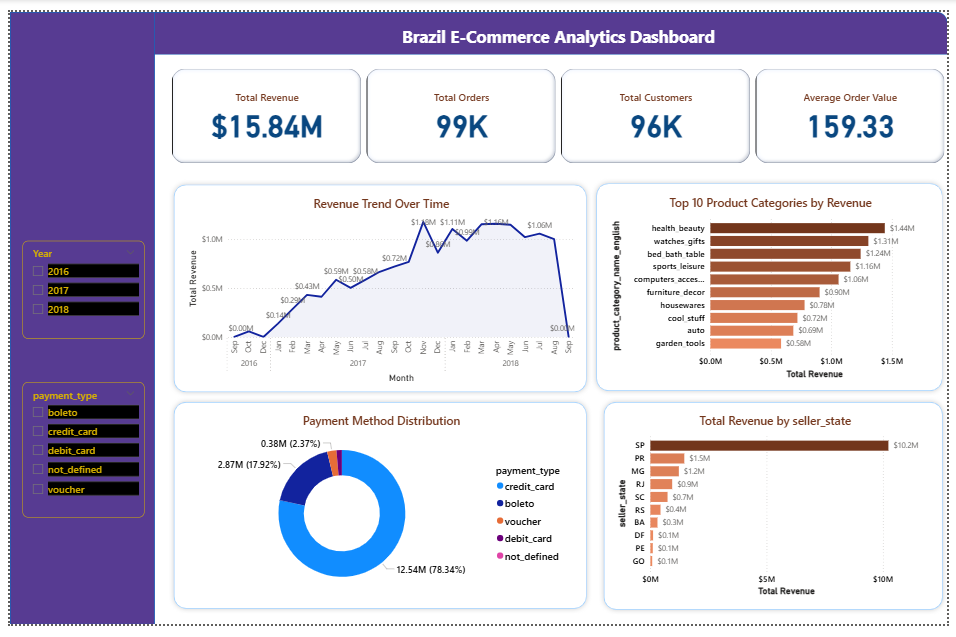
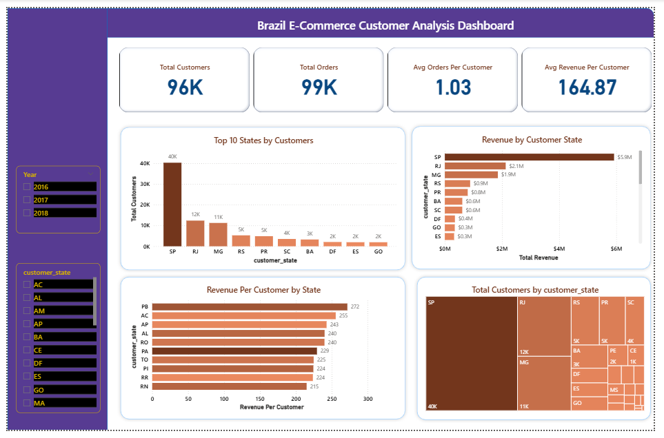
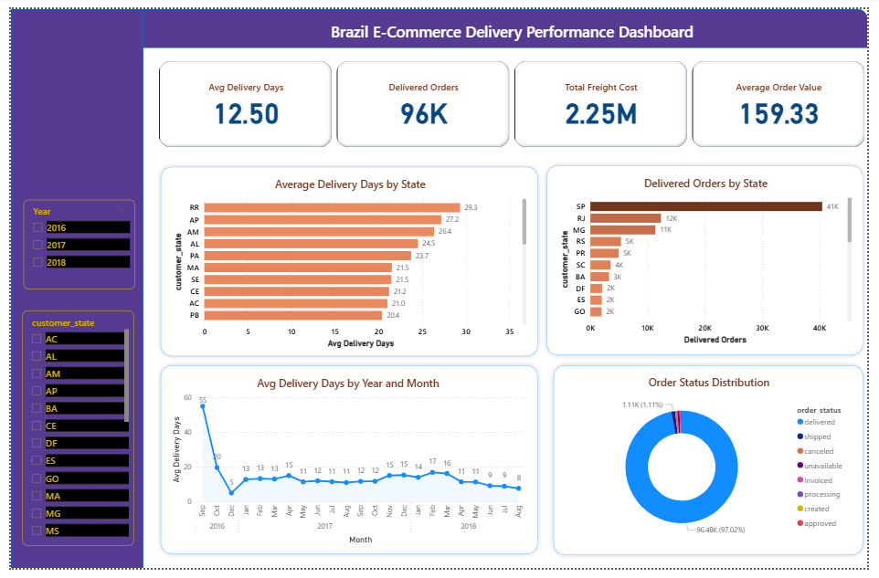
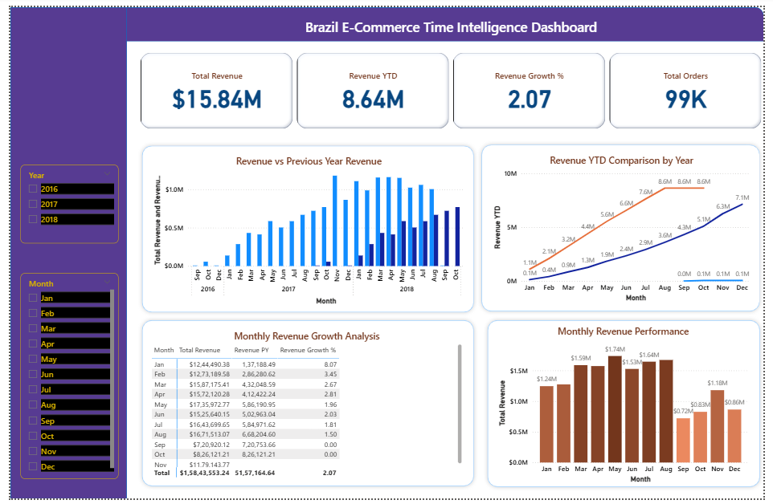

# Brazil E-Commerce Sales & Analytics Dashboard

## Project Overview

Developed a 4-page interactive Power BI dashboard analyzing **99K orders, 96K customers, and $15.84M revenue** from the Olist Brazilian E-Commerce dataset. The dashboard provides insights into business performance, customer distribution, delivery operations, and year-over-year revenue trends.

## Business Problem

How can an e-commerce business monitor overall revenue performance, identify high-value customer and seller regions, evaluate delivery efficiency, and track year-over-year revenue growth?

## Dashboard Pages

1. Business Overview
2. Customer Analysis
3. Delivery Performance Analysis
4. Time Intelligence Analysis

## Key Metrics

* Total Revenue: **$15.84M**
* Total Orders: **99K**
* Total Customers: **96K**
* Average Order Value: **$159.33**
* Average Delivery Days: **12.5 days**
* Credit Card Revenue Share: **78.34%**

## Key Insights

* Credit card was the dominant payment method, contributing **78.34%** of revenue.
* Health & beauty was the highest revenue-generating product category.
* SP was the leading state for customer and seller revenue.
* RR had the highest average delivery time at **29.3 days**, indicating regional logistics variation.

## Tools Used

* Power BI Desktop
* Power Query
* DAX
* Data Modeling
* Data Visualization

## Data Model

* Built a relational data model using interconnected order, customer, product, seller, payment, review, and category tables.
* Created relationships using common keys such as `order_id`, `customer_id`, `product_id`, and `seller_id`.
* Created a custom Date table to support time intelligence analysis.

## DAX Functions Used

* SUM
* COUNTROWS
* DISTINCTCOUNT
* DIVIDE
* AVERAGE
* DATEDIFF
* CALCULATE
* SAMEPERIODLASTYEAR
* TOTALYTD

## Dashboard Preview

### Business Overview

### Customer Analysis

### Delivery Performance Analysis

### Time Intelligence Analysis

## Dataset

Olist Brazilian E-Commerce Public Dataset from Kaggle.

